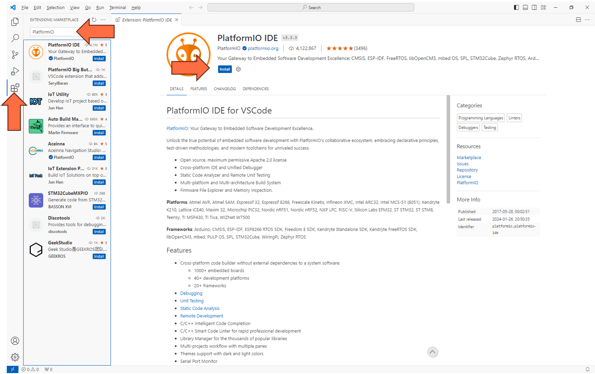
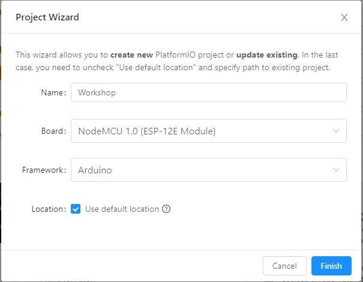
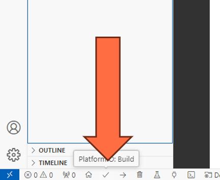
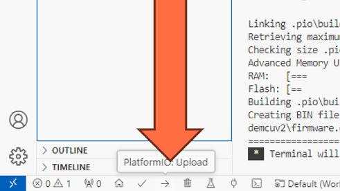
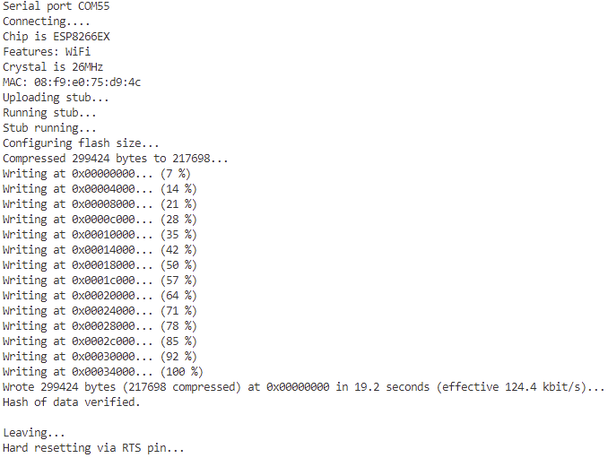

# STC6 Embedded Workshop

## Einrichtung
1. Visual Studio Code installieren
   
2. PlatformIO Extension installieren:\

1. Neues Projekt erstellen\

1.  
    - Name: beliebig
    - Board: **NodeMCU 1.0 (ESP-12E Module)**
    - Framework: **Arduino**
    - Auf Finish klicken\

1. Projekt kompilieren:\

1. Jetzt kann der ESP8266/NodeMCU per USB an den PC angeschlossen werden. In den meisten Fällen wird der Treiber, der von Windows mitgeliefert wird, nicht funktionieren. Dazu am besten einmal im Geräte-Manager nachschauen:\
\
   Sollte der korrekte Treiber wie hier im Screenshot fehlen, muss [der Treiber aus diesem Repository](CP210x_Universal_Windows_Driver.zip) installiert werden.

1. War die Treiberinstallation erfolgreich, kann nun zum ersten mal das Board geflasht werden:\

1. Das wars! Wenn das Flashen erfolgreich war, sollte die Ausgabe in etwa so aussehen:\
